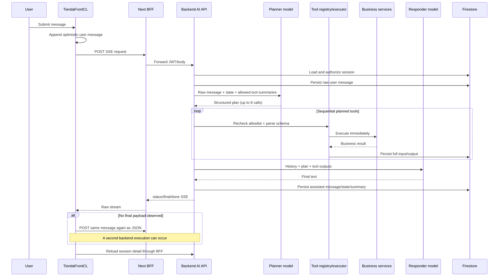
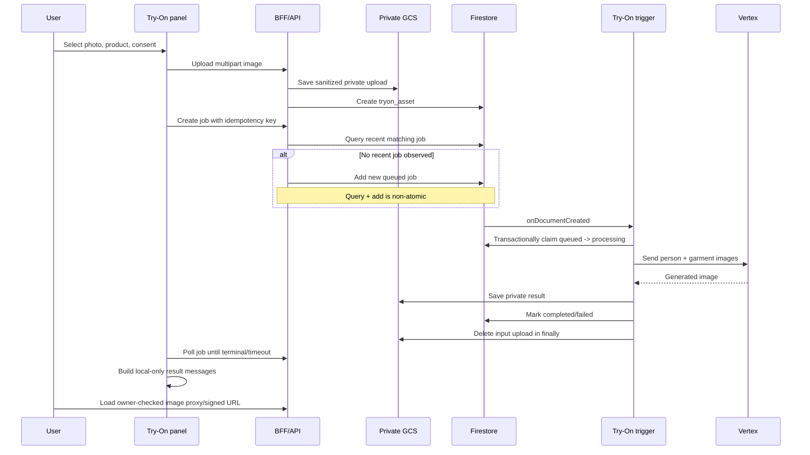

# Phase 1 AI Module Audit — Security and Impact Map

**Date:** 2026-07-16
**Scope:** `BackendCL` and `TiendaFrontCL` only
**Method:** Static, read-only source review
**Verification status:** No build, test, emulator, deployment, IAM, Firestore, GCS, Gemini, or Vertex command was executed.

## Snapshot and containment-candidate status

This audit records the **pre-containment snapshot** observed before the current
BackendCL candidate. Finding descriptions below remain historical evidence and
must not be read as claims that every item is still present in the candidate.

The current candidate contains only these Phase 0 controls:

- model access to direct stock, price, publish, and hide mutations is denied centrally;
- authenticated AI sessions are owner-only, including for ADMIN requesters;
- authenticated session detail fails closed for guest and foreign session IDs;
- public guest chat defaults to off while retaining explicit environment opt-in;
- the local secret file is removed from Git tracking and ignored, without deleting it locally.

The following security work remains open:

- rotate/revoke exposed credentials and remediate Git history, forks, and caches;
- design status-aware Try-On retention with a dry-run mode, metrics, and rollback;
- export and deploy cleanup only after those safeguards and deployment-batch coverage exist.

The current candidate does **not** activate or export the Try-On cleanup scheduler.

## Executive decision

The current León AI module must not be considered production-complete. It has a sound starting boundary—browser traffic normally passes through a Next.js BFF, backend authentication supplies the effective role, tool calls are filtered and schema-validated, business data comes from backend services, Firestore denies direct client access, and Try-On objects are private by default. Those controls are not sufficient for the current administrative, guest, retry, retention, and operational behavior.

The immediate blockers are:

1. Four sale-critical administrative tools can mutate inventory, price, and publication state directly from a single model-produced plan.
2. A tracked local secret file contains configured credentials and requires rotation and repository-history remediation.
3. Admin session access is evaluated using the requester role, so an ADMIN entering another user's session receives the ADMIN toolset in that customer conversation.
4. Public guest chat is enabled by default, has no TiendaFrontCL consumer, and can be combined with weak App Check/rate-limit behavior to create an unnecessary cost surface.
5. Try-On cleanup is implemented but not exported or deployed; idempotency creation is race-prone and processing jobs have no lease/recovery path.
6. Frontend stream fallback can submit the same user message a second time, which can duplicate model and tool execution.

## Review path

Review this artifact in this order:

1. Confirm the trust boundaries and tool permission matrix.
2. Triage all **Critical** and **High** findings before implementation.
3. Approve the Phase 0 containment actions.
4. Resolve the explicit unknowns before changing contracts or deleting legacy code.

## Scope and limitations

### Included

- Backend AI routes, controllers, services, planner, prompts, tool registry, RBAC, persistence, knowledge adapters, Try-On, cleanup, rate limiting, configuration, Firestore rules/indexes, tests, and deployment workflow.
- Frontend BFF, API client, conversation hook, `/ai`, PDP assistant, Try-On panel, `/admin/ai`, frontend AI types, legacy Genkit code, environment examples, and test/CI surface.

### Excluded

- All Flutter applications.
- Runtime validation of deployed Functions, IAM, Secret Manager, App Check, Firestore edition, indexes, TTL policies, buckets, Eventarc, Vertex quotas, or external consumers.
- Any code change, refactor, migration, branch, build, test, install, or deployment.

---

## 1. Current architecture

```mermaid
flowchart LR
    Browser[Browser / TiendaFrontCL UI]
    BFF[Next.js BFF\n/api/ai/[[...path]]]
    Public[Direct public guest client]
    API[BackendCL Express API\n/api/ai/*]
    Auth[Backend JWT middleware]
    Chat[Chat controller/service]
    Planner[Shared planner\nGemini fast model]
    Registry[Role-filtered tool registry]
    Exec[Sequential tool executor]
    Compose[Shared response composer\nGemini primary model]
    Business[Deterministic business services]
    FS[(Firestore tiendacl)]
    GCS[(Private GCS)]
    Trigger[Firestore Try-On trigger]
    Vertex[Vertex Try-On]
    AdminUI[/admin/ai]

    Browser -->|cookie/backend JWT, CSRF expected| BFF
    BFF -->|Authorization, request ID, optional App Check| API
    Public -->|guest token; no JWT| API
    API --> Auth
    Auth --> Chat
    Chat --> Planner
    Planner --> Registry
    Registry --> Exec
    Exec --> Business
    Business --> FS
    Exec --> Compose
    Compose --> Chat
    Chat --> BFF
    Browser -->|upload / poll / image| BFF
    BFF --> API
    API --> GCS
    API --> FS
    FS --> Trigger
    Trigger --> Vertex
    Vertex --> GCS
    AdminUI --> BFF
```

### Actual boundary observations

| Boundary | Current control | Material gap |
|---|---|---|
| Browser → BFF | Session-derived backend authorization; server-side CSRF validation | SSE and upload use manual `fetch` instead of the shared client helper and omit its CSRF/App Check headers. |
| BFF → Backend | BFF forwards a constrained header set and preserves raw SSE/image bodies | Catch-all path forwarding has no explicit AI endpoint allowlist. |
| Backend → Model | System instructions prohibit invention and prompt disclosure | No deterministic prompt-injection detector or separate admin prompt/policy. |
| Model → Tool | Role-filtered registry, second allowlist check, strict Zod parsing | Mutable admin tools execute immediately; metadata lacks confirmation, timeout, risk, ownership, and audit requirements. |
| Tool → Business data | Tools delegate to existing backend services | Order lookup permits phone fallback for an authenticated non-owner; PDP sends client price/stock into the model prompt. |
| Client → Firestore | Final wildcard deny blocks unmatched reads/writes | AI backend-only collections are not documented with explicit collection matches. |
| Try-On → GCS/Vertex | Ownership checks, private objects, signed URLs | Cleanup is undeployed; create idempotency is non-atomic; processing has no lease/recovery. |
| Admin UI → Admin APIs | Backend requires ADMIN | UI role check is only client-side UX; `/admin/ai` is not linked from admin navigation. |

Primary evidence: `TiendaFrontCL/src/app/api/ai/[[...path]]/route.ts`, `TiendaFrontCL/src/lib/server/backend-client.ts`, `BackendCL/functions/src/routes/ai.routes.ts`, `BackendCL/functions/src/services/ai/adapters/ai-orchestrator.ts`, `BackendCL/firestore.rules`.

---

## 2. Tool catalog and classification

The registry contains **32 tools** in `BackendCL/functions/src/services/ai/tools/definitions.ts`.

### 2.1 Public commercial tools — 20

These tools are available to guest sessions because `public !== false` and the registry is called with `publicOnly: true`.

| Tool | Classification | Operation | Ownership | Risk / note |
|---|---|---:|---:|---|
| `search_products` | Public catalog | Read | No | Backend product search. |
| `get_product_detail` | Public catalog | Read | No | Returns current backend detail. |
| `get_product_price` | Public catalog | Read | No | Backend price source. |
| `get_product_stock` | Public catalog | Read | No | Backend stock source. |
| `check_inventory` | Public catalog | Read | No | Duplicates the public-stock purpose of `get_product_stock`. |
| `get_product_variants` | Public catalog | Read | No | Variants and sizes. |
| `list_categories` | Public catalog | Read | No | Category enumeration. |
| `list_lines` | Public catalog | Read | No | Line/audience enumeration. |
| `list_collections` | Public knowledge | Read | No | Knowledge-derived collection summaries. |
| `get_related_products` | Public catalog | Read | No | Related products. |
| `get_product_link` | Public catalog | Read | No | Canonical product link. |
| `search_faq` | Public knowledge | Read | No | Official FAQ search. |
| `get_faq_answer` | Public knowledge | Read | No | Knowledge bundle by topic. |
| `get_shipping_info` | Public policy | Read | No | Shipping policy/configuration. |
| `get_return_policy` | Public policy | Read | No | Return/change policy. |
| `get_promotions` | Public promotion | Read | No | Active promotion documents. |
| `get_store_info` | Public store info | Read | No | Store/contact/location. |
| `get_payment_methods` | Public commerce | Read | No | Supported payment methods. |
| `detect_image_referenced_product` | Public asset helper | Read | **Missing** | Dereferences an arbitrary asset ID without owner/session verification. |
| `handoff_to_human` | Public support action | Action-like | No | Returns a synthetic `queued` object but creates no real support case. |

### 2.2 Authenticated commercial tools — 7

| Tool | Classification | Operation | Ownership | Risk / note |
|---|---|---:|---:|---|
| `get_order_status` | Customer private | Read | Partial | Owner, privileged role, **or matching phone** can authorize. |
| `create_cart` | Customer cart | Write | Context user | Uses requester `userId`. |
| `add_to_cart` | Customer cart | Write | Context user | Backend cart and stock validation remain required. |
| `remove_from_cart` | Customer cart | Write | Context user | Uses requester cart. |
| `create_tryon_job` | Customer Try-On | Write | Enforced | Session and upload must belong to requester. |
| `get_tryon_status` | Customer Try-On | Read | Enforced | Owner or ADMIN. |
| `get_tryon_download_link` | Customer Try-On | Read | Enforced | Owner or ADMIN; signed URL. |

### 2.3 Internal/admin tools — 5

| Tool | Classification | Roles/capability | Operation | Confirmation | Risk |
|---|---|---|---:|---:|---|
| `admin_update_stock` | Inventory write | EMPLEADO+`inventory`, ADMIN | Write | **None** | Critical direct inventory mutation. |
| `admin_view_private_inventory` | Inventory read | EMPLEADO+`inventory`, ADMIN | Read | N/A | Exposes internal alert/inventory detail. |
| `admin_update_price` | Admin write | ADMIN | Write | **None** | Critical direct sale-price mutation. |
| `admin_publish_product` | Admin write | ADMIN | Write | **None** | Critical direct publication mutation. |
| `admin_hide_product` | Admin write | ADMIN | Write | **None** | Critical direct publication mutation. |

### 2.4 Missing tool metadata

`RuntimeAiToolDefinition` currently declares name, description, schema, roles, capabilities, public visibility, and executor only. It does not declare:

- read/write/internal classification;
- ownership requirement and resolver;
- confirmation requirement;
- allowed scopes independent of role;
- timeout;
- maximum records;
- parallel-execution safety;
- risk level;
- audit class;
- idempotency requirement;
- feature flag or toolset version.

Evidence: `BackendCL/functions/src/services/ai/tools/types.ts:29-52`.

---

## 3. Permission matrix

| Actor/session | Effective tool access | Private data | Mutations | Notes |
|---|---:|---|---|---|
| Guest | 20 public tools | None intended | Synthetic handoff only | Internally represented as `CLIENTE`; public endpoints default enabled. |
| Authenticated CLIENTE | 27 commercial tools | Own cart/Try-On; order ownership is weaker than required | Cart and Try-On job creation | Phone fallback can authorize a non-owned order. |
| EMPLEADO without inventory scope | 27 commercial tools | Customer-style plus privileged order lookup behavior in business service | Cart/Try-On | Shared customer prompt/toolset. |
| EMPLEADO with inventory scope | 29 tools | Adds private inventory | Direct stock mutation | No preview/confirmation. |
| ADMIN in own or another user's session | All 32 tools | All order/Try-On/admin data reachable through tools | Direct stock, price, publish, hide | Tool selection uses requester ADMIN role, not the persisted session role/context. |

### Session-role confusion

`AiChatService` permits ADMIN to use another user's authenticated session. `AiOrchestrator` then calculates capabilities and allowed tools from the incoming requester role. Therefore entering a customer session as ADMIN turns that conversation into an ADMIN-capable execution context rather than preserving the session's original commercial-agent boundary.

Evidence:

- `BackendCL/functions/src/services/ai/ai-chat.service.ts:106-120`
- `BackendCL/functions/src/services/ai/adapters/ai-orchestrator.ts:151-168`

---

## 4. Current chat flow



### Chat flow findings

- The planner and responder share commercial prompts for all roles; no admin-specific instruction or tool policy exists.
- Tool outputs are grounded in backend services, but administrative execution is not confirmation-gated.
- The SSE generator emits only coarse `status`, `final`, `error`, and `done`; it does not stream tool lifecycle or text deltas.
- Disconnect/retry has no message-level idempotency key.
- The hook's JSON fallback resends the message if a final SSE payload was not observed, even if the backend already persisted and executed it.
- The first 12 ascending messages are used as model history rather than the newest 12, because `orderBy(createdAt, asc).limit(maxContextMessages)` is used.

Evidence: `BackendCL/functions/src/services/ai/adapters/ai-orchestrator.ts`, `BackendCL/functions/src/services/ai/memory/message.service.ts`, `TiendaFrontCL/src/hooks/use-ai-conversation.ts:227-340`, `TiendaFrontCL/src/lib/api/ai.ts:502-659`.

---

## 5. Current Try-On flow



### Try-On flow findings

- Ownership and consent are checked before creation.
- The idempotency check and document creation are separate operations, so concurrent identical requests can both create jobs.
- Once a job is claimed as `processing`, there is no lease expiry, retry counter, watchdog, or recovery transition for worker crashes/timeouts.
- Input cleanup runs in the worker `finally`, but queued/stuck jobs rely on the scheduled cleanup.
- The scheduled cleanup is not exported from `functions/src/index.ts` and is not in deployment batches.
- Frontend Try-On user/result messages are component-local and disappear after reload; they are not persisted as AI messages.
- The frontend consent copy promises automatic deletion after processing. Successful/failed worker execution deletes the original upload, but queued/stuck assets can remain indefinitely while cleanup is undeployed; generated outputs also exceed intended retention.

Evidence: `BackendCL/functions/src/services/ai/jobs/tryon-workflow.service.ts:256-377,402-504`, `BackendCL/functions/src/services/ai/jobs/tryon-job.service.ts:55-122`, `BackendCL/functions/src/tryon-cleanup.cron.ts`, `BackendCL/functions/src/index.ts`, `TiendaFrontCL/src/components/ai/ai-try-on-panel.tsx:216-304`.

---

## 6. Dependency and consumer map

### Backend chat and tools

```text
functions/src/routes/ai.routes.ts
  -> controllers/ai/chat.controller.ts
     -> services/ai/ai-chat.service.ts
        -> memory/session.service.ts
        -> adapters/ai-orchestrator.ts
           -> planning/chat-planner.service.ts
              -> adapters/gemini.adapter.ts
              -> ai.prompts.ts
           -> rbac/tool-registry.service.ts
              -> rbac/role-tool-mapper.service.ts
              -> tools/definitions.ts
                 -> knowledge/store-business.service.ts
                    -> product/cart/order/payment/inventory services
                 -> jobs/tryon-workflow.service.ts
           -> memory/message.service.ts
           -> memory/tool-call.service.ts
```

### Backend Try-On

```text
routes/ai.routes.ts
  -> controllers/ai/files.controller.ts
     -> services/ai/ai-file.service.ts
        -> storage/ai-upload-validator.service.ts
        -> storage/ai-storage.service.ts
        -> jobs/tryon-asset.service.ts
  -> controllers/ai/tryon.controller.ts
     -> jobs/tryon-workflow.service.ts
        -> jobs/product-preview-policy.service.ts
        -> jobs/tryon-job.service.ts
        -> adapters/vertex-tryon.adapter.ts

tryon_jobs/{jobId} create
  -> jobs/tryon-processor.trigger.ts
  -> exported as processTryOnJob in functions/src/index.ts

tryon-cleanup.cron.ts
  -> jobs/tryon-workflow.service.ts cleanupExpiredAssets
  -> NOT imported/exported by functions/src/index.ts
```

### Frontend

```text
src/app/ai/page.tsx
  -> src/app/ai/workspace.tsx
     -> src/hooks/use-ai-conversation.ts
     -> src/components/ai/ai-try-on-panel.tsx

src/app/products/[id]/product-qna.tsx
  -> src/lib/ai/message-content.ts
  -> src/hooks/use-ai-conversation.ts
  -> src/components/ai/ai-try-on-panel.tsx

src/app/admin/ai/page.tsx
  -> src/lib/api/ai.ts

src/lib/api/ai.ts
  -> /api/ai/*
  -> src/app/api/ai/[[...path]]/route.ts
  -> src/lib/server/backend-client.ts
  -> BackendCL /api/ai/*
```

---

## 7. Severity-ranked findings

### Critical

#### P1-ADMIN-001 — Direct sale-critical mutations from a conversational plan

**Impact:** A prompt, model error, injected instruction, or ambiguous request can immediately modify stock, public price, or product visibility. There is no prepare/confirm/commit state machine, proposal hash, expiry, idempotent commit, record cap, rollback record, or full before/after audit.

**Evidence:**

- `BackendCL/functions/src/services/ai/tools/definitions.ts:326-368`
- `BackendCL/functions/src/services/ai/adapters/ai-orchestrator.ts:213-272`
- `BackendCL/functions/src/services/ai/memory/audit-log.service.ts` exists but has no caller.

#### P1-SECRETS-001 — Configured credentials are tracked in Git

**Impact:** Repository readers and repository history can expose operational credentials.

**Evidence:** `BackendCL/functions/.secret.local` is tracked and contains set FedEx credential fields, including `FEDEX_CLIENT_SECRET`. Values are intentionally omitted from this report.

### High

#### P1-ADMIN-002 — ADMIN can elevate another user's session to the admin toolset

**Impact:** Session context and agent privileges are not separated. An ADMIN opening a customer session causes tool selection to use the requester ADMIN role, making all 32 tools available in that conversation.

**Evidence:** `BackendCL/functions/src/services/ai/ai-chat.service.ts:106-120`; `BackendCL/functions/src/services/ai/adapters/ai-orchestrator.ts:151-168`.

#### P1-SESSION-001 — Guest-session detail IDOR

**Impact:** Any authenticated user who obtains a guest session ID can retrieve that session, messages, and tool calls without the guest token.

**Evidence:** `BackendCL/functions/src/controllers/ai/chat.controller.ts:113-137`; `BackendCL/functions/src/services/ai/ai-chat.service.ts:189-208`.

#### P1-OWNERSHIP-001 — Authenticated order access can fall back to phone possession

**Impact:** A CLIENTE can access another user's order status if the order ID and matching phone are known. This contradicts the requirement that authenticated customers only access their own orders.

**Evidence:** `BackendCL/functions/src/services/orden.service.ts:1907-1957`; `BackendCL/functions/src/services/ai/knowledge/order-support.service.ts`.

#### P1-ASSET-001 — Public image-reference tool lacks ownership verification

**Impact:** A guest or authenticated user can submit another asset ID and cause backend dereferencing of its product/variant/kind metadata.

**Evidence:** `BackendCL/functions/src/services/ai/knowledge/store-business.service.ts:228-260`; `BackendCL/functions/src/services/ai/tools/definitions.ts:228-241`.

#### P1-GUEST-001 — Guest chat is an unnecessary default-on abuse surface

**Impact:** Public model-cost endpoints remain active without a TiendaFrontCL consumer, token expiry, message cap, session budget, or explicit production enablement decision.

**Evidence:** `BackendCL/functions/src/config/ai.config.ts:192-204`; `BackendCL/functions/src/routes/ai.routes.ts:43-57`; `BackendCL/docs/ai-frontend-integration.md:25-30`; `TiendaFrontCL/src/app/api/ai/[[...path]]/route.ts:22-27`.

#### P1-RATE-001 — App Check identity rotation and distributed fail-open weaken quotas

**Impact:** When App Check enforcement is absent, invalid tokens continue and their fingerprints change the quota key. Attackers can rotate invalid tokens. Distributed Firestore errors then fall back to per-instance memory, breaking horizontal consistency.

**Evidence:** `BackendCL/functions/src/utils/middlewares.ts:369-410`; `BackendCL/functions/src/middleware/rate-limit.middleware.ts:46-54,114-149`.

#### P1-TRYON-001 — Retention cleanup is not deployed

**Impact:** Personal uploads for queued/stuck jobs and generated results can persist beyond policy.

**Evidence:** `BackendCL/functions/src/tryon-cleanup.cron.ts`; absence from `BackendCL/functions/src/index.ts`; absence from `BackendCL/.github/workflows/deploy-functions.yml:194-200`.

#### P1-TRYON-002 — Try-On idempotency has a race

**Impact:** Concurrent requests with one idempotency key can both observe no prior job and create duplicate cost-bearing jobs.

**Evidence:** `BackendCL/functions/src/services/ai/jobs/tryon-workflow.service.ts:275-299,362-376`; `BackendCL/functions/src/services/ai/jobs/tryon-job.service.ts:42,55-75`.

#### P1-TRYON-003 — Processing jobs have no lease or recovery

**Impact:** A worker crash after `queued -> processing` leaves a permanently stuck job; the create idempotency path treats only queued, processing, completed, and selected quota failures specially and has no recovery workflow.

**Evidence:** `BackendCL/functions/src/services/ai/jobs/tryon-job.service.ts:91-122`; `BackendCL/functions/src/services/ai/jobs/tryon-workflow.service.ts:402-478`.

#### P1-API-001 — AI configuration can take down the entire ecommerce API

**Impact:** The top-level HTTPS function validates Gemini, Try-On, and storage before invoking the Express app, so missing AI configuration can fail unrelated catalog, auth, checkout, and payment routes.

**Evidence:** `BackendCL/functions/src/index.ts:54-77`; `BackendCL/functions/src/config/ai.config.ts:235-280`.

#### P1-FRONTEND-001 — Manual SSE/upload calls bypass the shared request helper

**Impact:** The manual requests omit the shared client's CSRF and App Check headers. Server CSRF should reject unsafe calls rather than being bypassed, producing reliability failures; lack of App Check propagation also weakens the intended client-attestation path.

**Evidence:** `TiendaFrontCL/src/lib/api/ai.ts:502-521,661-677`; compare shared behavior in `TiendaFrontCL/src/lib/api/client.ts` and server enforcement in `src/lib/server/backend-client.ts:86-93`.

#### P1-FRONTEND-002 — JSON fallback can duplicate a message and its tools

**Impact:** If the backend completes/persists an SSE request but the final event is not observed, the hook posts the same message again as JSON. This can duplicate cart changes, Try-On creation, cost, or—until P1-ADMIN-001 is removed—admin mutations.

**Evidence:** `TiendaFrontCL/src/hooks/use-ai-conversation.ts:263-310`.

#### P1-OBS-001 — Sensitive content is stored/logged without adequate redaction or lifecycle

**Impact:** Raw messages, normalized text, tool inputs, and tool outputs can contain PII, order data, phones, or internal inventory. There is no trace schema, prompt/toolset version, cost record, or active AI mutation audit.

**Evidence:** `BackendCL/functions/src/services/ai/adapters/ai-orchestrator.ts:170-176,194-204,253-262`; `BackendCL/functions/src/utils/logger.ts:6-20`; `BackendCL/functions/src/services/ai/memory/*`.

#### P1-CI-001 — Failed backend tests do not block deployment

**Impact:** Auth, ownership, pricing, or Try-On regressions can deploy after test failure.

**Evidence:** `BackendCL/.github/workflows/deploy-functions.yml:40-44` uses `continue-on-error: true`; frontend has no tracked workflow.

### Medium

#### P1-PDP-001 — PDP treats client product data as model context

**Impact:** Price, sale price, stock, sizes, colors, and description are serialized into user prompt text. This duplicates dynamic business data and allows stale/client-derived values to influence the answer instead of passing only a product ID for backend lookup.

**Evidence:** `TiendaFrontCL/src/lib/ai/message-content.ts:39-62,94-102`; `TiendaFrontCL/src/app/products/[id]/product-qna.tsx:80-89`.

#### P1-BFF-001 — Generic AI proxy has no endpoint allowlist

**Impact:** Any future BackendCL route below `/api/ai/*` automatically becomes reachable through the authenticated BFF unless individually protected. The BFF cannot encode guest/admin/upload-specific policy cleanly.

**Evidence:** `TiendaFrontCL/src/app/api/ai/[[...path]]/route.ts:4-49`.

#### P1-DATA-001 — AI persistence lacks complete retention and pagination

**Impact:** Sessions, messages, tool calls, audit logs, jobs, and `_rateLimits` grow without an enforced lifecycle. Fixed limits have no cursors; tool-call history can be unbounded.

**Evidence:** `BackendCL/functions/src/models/ai/ai.model.ts:180-295`; `BackendCL/functions/src/services/ai/memory/*.ts`; `BackendCL/functions/src/services/rate-limit-store.service.ts`.

#### P1-CONFIG-001 — AI flags and limits are incomplete, duplicated, or unused

**Impact:** Guest and Try-On default on; requested rollout flags are absent; `AI_MAX_TOOL_STEPS`, `AI_ENABLE_SSE`, and Gemini timeout are not enforced; env sources drift across examples and workflow generation.

**Evidence:** `BackendCL/functions/src/config/ai.config.ts`; backend env examples; `BackendCL/.github/workflows/deploy-functions.yml`.

#### P1-GROUNDING-001 — Prompt injection protection is advisory only

**Impact:** The prompts instruct the model not to reveal internals, but there is no deterministic injection detection, taint handling for retrieved text, per-tool risk gate, or security-eval dataset.

**Evidence:** `BackendCL/functions/src/services/ai/ai.prompts.ts`; `BackendCL/functions/tests/ai.evals.test.ts`.

#### P1-UX-001 — Structured commercial responses and persisted Try-On messages are absent

**Impact:** The frontend primarily renders text plus basic suggestions. It lacks a structured response contract for product cards, comparisons, sources, cart actions, confirmations, feedback, and support escalation. Try-On results are local-only.

**Evidence:** `TiendaFrontCL/src/lib/ai/types.ts`; `TiendaFrontCL/src/components/ai/ai-message-thread.tsx`; `TiendaFrontCL/src/components/ai/ai-try-on-panel.tsx:45-72,268-284`.

#### P1-EVAL-001 — Current eval is not an AI evaluation system

**Impact:** Five normalizer fixtures do not measure tool choice, arguments, factual grounding, permissions, hallucination, latency, or cost and are not baseline-gated.

**Evidence:** `BackendCL/functions/tests/ai.evals.test.ts:1-40`; no frontend AI tests or AI E2E specs found.

### Low

#### P1-NAV-001 — `/admin/ai` is not linked from admin navigation

**Impact:** The page exists but is undiscoverable through the authorized admin menu.

**Evidence:** `TiendaFrontCL/src/app/admin/ai/page.tsx`; no `/admin/ai` reference under frontend navigation components.

#### P1-CI-002 — CI/runtime Node versions differ

**Impact:** CI builds with Node 20 while Functions declares Node 22, allowing environment-specific behavior.

**Evidence:** `BackendCL/.github/workflows/deploy-functions.yml:24-27`; `BackendCL/functions/package.json`.

---

## 8. Firestore, indexes, and backend-only collections

### Collections

| Collection | Writer/reader | Current retention | Required action |
|---|---|---|---|
| `ai_sessions` | Admin SDK via AI service | None | Add version, `expiresAt`, archive/delete policy, pagination. |
| `ai_messages` | Admin SDK via AI service | None | Add trace/message idempotency, redaction policy, TTL decision, cursor pagination. |
| `ai_tool_calls` | Admin SDK via orchestrator | None | Redact payloads; add trace/toolset/version and retention. |
| `ai_audit_logs` | Service exists, unused | None | Make append-only mutation audit active; define long-term retention. |
| `tryon_jobs` | API + Firestore trigger | None | Add lease/retry fields, expiry, recovery, version. |
| `tryon_assets` | API/worker | Manual cleanup only | Add `expiresAt` and deploy cleanup/TTL. |
| `faqTienda` | Backend knowledge | Business-managed | Version/publish workflow and injection-safe retrieval. |
| `politicasTienda` | Backend knowledge | Business-managed | Version/effective dates/source citation. |
| `knowledgeTienda` | Backend knowledge | Business-managed | Version, provenance, sanitization. |
| `promocionesTienda` | Backend knowledge | Business-managed | Ensure authoritative promotion service remains source of truth. |
| `_rateLimits` | Distributed limiter | No deletion; numeric expiry only | Use TTL-compatible timestamp or periodic deletion. |

### Rules assessment

`BackendCL/firestore.rules:60-63` securely denies all unmatched client reads and writes, which currently protects AI collections. The request asks for explicit backend-only collection declarations; adding them improves reviewability and prevents future broad-rule edits from accidentally changing AI exposure.

### Index assessment

The backend index file contains composites for current session, message, tool-call, user-job, and idempotency queries (`BackendCL/firestore.indexes.json:813-908`). Deployment state was not verified. `TiendaFrontCL/firestore.indexes.json` duplicates only part of the AI index surface, while `TiendaFrontCL/firebase.json` references a `firestore.rules` file that is not present; BackendCL should be the documented authority for backend Firestore rules/indexes.

---

## 9. Dead-code and legacy candidates

These are **candidates**, not deletion approvals. Consumer verification is required before removal.

| Candidate | Evidence | Decision needed |
|---|---|---|
| `TiendaFrontCL/src/ai/` Genkit flows | Only imported by `src/ai/dev.ts`; package scripts `genkit:dev`/`genkit:watch` are the only external consumers found. | Remove and dependencies if no active developer workflow; otherwise move/document as dev-only. |
| `vertex-preview-mockup.adapter.ts` | Current policy rejects non-body Try-On modes; runtime job processing calls the body Try-On adapter. | Confirm no planned/hidden consumer before removal or formalization. |
| `tryon-cleanup.cron.ts` | Defined but not exported/deployed. | This is not dead behavior; wire and verify it or replace with TTL. |
| `aiAuditLogService` | Implemented but no caller. | Integrate into mutation lifecycle or remove only after the replacement audit design exists. |
| Guest endpoints | Backend/docs/tests exist; no TiendaFrontCL consumer found. | Disable by default now; remove only after confirming no external consumer. |
| `handoff_to_human` | Returns a synthetic queued result without creating a support case. | Replace with a verifiable integration or rename as an informational suggestion. |
| `check_inventory` | Overlaps public behavior with `get_product_stock`. | Consolidate only after prompt/eval/consumer analysis. |
| `AI_MAX_TOOL_STEPS`, `AI_ENABLE_SSE`, Gemini timeout config | Declared but not enforced by the main runtime. | Implement or remove after compatibility analysis. |

---

## 10. Documentation and code drift

| Documentation/request claim | Current code reality |
|---|---|
| Critical admin mutations require preview and confirmation. | Four tools mutate immediately. |
| Customer and admin agents have separate prompts/tool policies. | One shared planner/responder prompt and orchestrator. |
| Authenticated customers only see their own orders. | Matching phone can authorize another order. |
| Guest is disabled unless commercially required. | Guest defaults enabled and examples advertise it; TiendaFrontCL has no guest consumer. |
| Cleanup cron is active and retention verified. | Cron exists but is not exported/deployed. |
| Idempotency prevents duplicate Try-On jobs. | Check-then-create is non-atomic. |
| Streaming reconnection does not duplicate messages. | JSON fallback may resubmit the same message. |
| PDP context relies on backend truth. | Frontend serializes client price/stock/description into the prompt. |
| AI configuration is isolated from unrelated commerce paths. | AI validation gates the entire Express API function. |
| `/admin/ai` is integrated into authorized navigation. | Page exists; no navigation link found. |
| Evals are versioned and deployment-blocking. | Five normalizer fixtures; CI does not gate evals and unit tests are non-blocking. |
| Frontend integration guide exposes a guest path. | Generic frontend BFF requires auth for every AI suffix. |

---

## 11. Regression risks

| Area | Regression risk | Required protection before change |
|---|---|---|
| Tool split | Customer loses legitimate catalog/cart tools or admin gains them accidentally | Registry contract tests for every role/session mode and session-owner/requester combination. |
| Admin confirmation | Partial commits, stale previews, duplicate execution | Transactional state machine, idempotency tests, before/after audit, failure recovery. |
| Order ownership | Existing guest/support order lookup may depend on phone | Product decision and separate, rate-limited recovery endpoint; never use phone fallback for authenticated customer ownership. |
| Guest disablement | Unknown external consumer may break | Runtime traffic check and explicit owner approval. |
| BFF hardening | SSE, multipart boundaries, cookies, or image streaming can break | Integration tests through Next BFF, including CSRF/App Check and disconnect behavior. |
| Try-On idempotency | Duplicate or lost jobs during migration | Firestore transactional create/key document and concurrency tests. |
| Try-On recovery | Reprocessing can double provider cost | Lease token, attempt counter, terminal idempotency, provider request correlation. |
| Cleanup/TTL | Premature deletion can break active jobs/downloads | Status-aware expiration, grace period, dry-run inventory, rollback plan. |
| Firestore indexes | Session/job views can fail at runtime | Emulator/query tests and deploy index verification before code rollout. |
| PDP grounding | Removing client context can reduce product awareness | Pass immutable `productId`/page context separately and force backend detail/price/stock tools. |
| Legacy Genkit removal | Developer scripts may be used outside tracked imports | Confirm owners, CI, local docs, and deployment processes first. |
| Config isolation | Cold-start behavior can change | Route-specific lazy validation plus smoke tests for non-AI endpoints when AI is disabled/misconfigured. |

---

## 12. Phased remediation plan

### Phase 0 — Immediate containment

| Action | Finding IDs | Exit evidence |
|---|---|---|
| Rotate/revoke committed credentials; remove tracked secret and purge history. | P1-SECRETS-001 | Rotation record, repository scan, clean history policy. |
| Disable mutable admin tools with a backend feature flag. | P1-ADMIN-001, P1-ADMIN-002 | Registry tests prove tools are unavailable. |
| Set guest chat default and production value to false. | P1-GUEST-001, P1-RATE-001 | Runtime config and route smoke test. |
| Make backend tests blocking; align Node 22. | P1-CI-001, P1-CI-002 | Failed test blocks workflow. |
| Export and deploy a safe Try-On cleanup job, initially in dry-run/metrics mode. | P1-TRYON-001 | Export check, deploy receipt, dry-run counts, alert. |

### Phase 1 — Critical security architecture

| Action | Finding IDs | Exit evidence |
|---|---|---|
| Create separate commercial and administrative agent contexts, prompts, registries, and session modes. | P1-ADMIN-001, P1-ADMIN-002, P1-GROUNDING-001 | Cross-role negative tests; customer session can never receive admin tools. |
| Implement prepare → confirm → commit with stored proposal, hash, expiry, actor, idempotency key, record cap, revalidation, and audit. | P1-ADMIN-001, P1-OBS-001 | Permission, expiry, tamper, repeat, partial-failure tests. |
| Fix guest-session, order, and asset ownership. | P1-SESSION-001, P1-OWNERSHIP-001, P1-ASSET-001 | Foreign-ID tests with zero tolerance. |
| Separate AI startup validation from the ecommerce API. | P1-API-001 | Non-AI smoke tests pass with AI disabled/misconfigured. |
| Make Try-On create atomic and add processing leases/recovery. | P1-TRYON-002, P1-TRYON-003 | Concurrency and crash-recovery tests. |

### Phase 2 — Request reliability and abuse controls

| Action | Finding IDs | Exit evidence |
|---|---|---|
| Add message ID/idempotency across SSE and JSON; never repost after ambiguous completion. | P1-FRONTEND-002 | Disconnect/reconnect integration test proves one persisted user message and one tool execution. |
| Route SSE/upload through a shared request-header policy and add explicit BFF path/method policy. | P1-FRONTEND-001, P1-BFF-001 | CSRF, App Check, multipart, SSE, image-stream integration tests. |
| Enforce verified App Check for guest, distributed per-user/IP/session/endpoint/tool budgets, and fail-closed cost controls. | P1-GUEST-001, P1-RATE-001 | Multi-instance quota tests and 429 contract. |
| Enforce tool timeout, max steps, record limits, and loop/cost budgets. | P1-CONFIG-001 | Timeout/budget tests and cost alerts. |

### Phase 3 — Data lifecycle, grounding, and observability

| Action | Finding IDs | Exit evidence |
|---|---|---|
| Add schema versions, `expiresAt`, cursor pagination, TTL/cleanup, and backend-only rule comments/matches. | P1-DATA-001, P1-TRYON-001 | Emulator tests, index verification, cleanup metrics. |
| Replace PDP dynamic prompt data with trusted page `productId` context and backend tools. | P1-PDP-001 | Stale/tampered client price and stock cannot affect response. |
| Add `traceId`, message ID, anonymized user ID, prompt/toolset/model versions, tool timings, tokens, cost, result, feedback, and redaction. | P1-OBS-001 | Trace reconstruction and PII-redaction tests. |
| Replace live admin counts with time-windowed aggregates and pagination. | P1-OBS-001, P1-DATA-001 | Metrics query-cost evidence and admin filters. |

### Phase 4 — Commercial UX, evals, CI/CD, and legacy cleanup

| Action | Finding IDs | Exit evidence |
|---|---|---|
| Introduce versioned structured response blocks for products, comparisons, sources, cart actions, confirmations, feedback, and support. | P1-UX-001 | Frontend schema tests and E2E flows. |
| Persist Try-On conversation events and add `/admin/ai` navigation. | P1-UX-001, P1-NAV-001 | Reload/E2E and authorized navigation tests. |
| Create versioned eval datasets and baseline gates for factuality, tool choice, ownership, injection, latency, and cost. | P1-EVAL-001, P1-GROUNDING-001 | Reproducible eval command and deployment threshold. |
| Add frontend unit/integration/E2E, secret/dependency scans, index/export/env checks, builds, smoke tests, rollout flags, and rollback documentation. | P1-CI-001, P1-CONFIG-001 | Blocking CI matrix and rollback rehearsal. |
| Decide and remove/formalize Genkit, mockup adapter, guest endpoints, fake handoff, and duplicate tools. | Dead-code candidates | Consumer evidence, focused commits, passing build/tests. |

---

## 13. Explicit unknowns requiring verification

1. Which AI functions, flags, indexes, rules, TTL policies, and cleanup schedules are actually deployed in each environment?
2. Is `AI_PUBLIC_CHAT_ENABLED` intentionally enabled in production, and is any external web/native client consuming it?
3. Is App Check enforcement active on the deployed API, and which Firebase project issues accepted tokens?
4. What is the Firestore edition for the `tiendacl` database?
5. Are any credentials from the tracked `.secret.local` file still valid or present in Git history/forks/caches?
6. What IAM roles do the API and Try-On worker service accounts have on Firestore, GCS, Vertex, and Cloud Run?
7. Are Eventarc retries and dead-letter handling configured for `processTryOnJob` outside source code?
8. What retention periods are legally/product-approved for raw conversations, audit logs, original photos, generated images, traces, and guest sessions?
9. Is phone-based order lookup a required unauthenticated recovery feature? If so, what stronger proof, throttling, and separate endpoint are required?
10. Does a real support/ticketing service exist for `handoff_to_human`?
11. Does any developer or deployment process rely on TiendaFrontCL Genkit scripts or the preview mockup adapter?
12. Which source is authoritative for frontend/backend Firestore deployment configuration?
13. Are product descriptions or knowledge documents editable by untrusted actors, and what sanitization/provenance workflow exists?
14. What business metrics define assisted conversion and revenue attribution?
15. What rollout/rollback mechanism is available today for chat, Try-On, guest, admin tools, structured responses, and model versions?

---

## 14. Phase 1 exit checklist

- [ ] Critical credentials rotated and repository history remediated.
- [ ] Mutable admin tools disabled pending confirmation architecture.
- [ ] Guest disabled by default and production decision documented.
- [ ] Customer/admin agent boundary approved.
- [ ] Session, order, and asset ownership requirements approved.
- [ ] Try-On atomic idempotency and recovery design approved.
- [ ] Cleanup export/deployment and retention policy approved.
- [ ] AI config isolated from non-AI API availability.
- [ ] SSE/message idempotency contract approved.
- [ ] Firestore authority, indexes, TTL, and pagination plan approved.
- [ ] Blocking test/eval/CI requirements approved.
- [ ] Legacy/dead-code consumers explicitly verified before deletion.

## Final assessment

The module has enough implemented structure to evolve safely without a wholesale rewrite, but Phase 1 must first remove direct administrative execution, fix ownership and retry semantics, contain guest/cost exposure, and establish deployment-verifiable retention and audit controls. No later commercial or visual enhancement should bypass these blockers.
