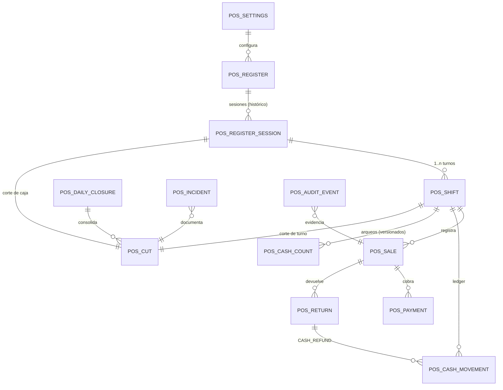
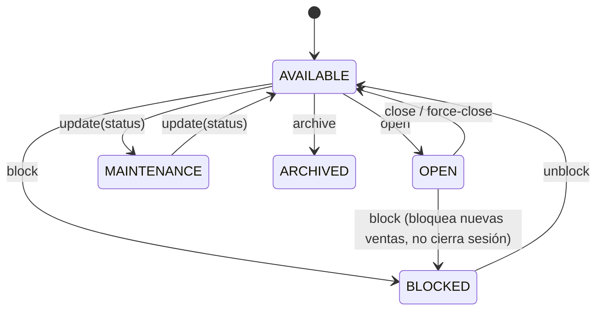
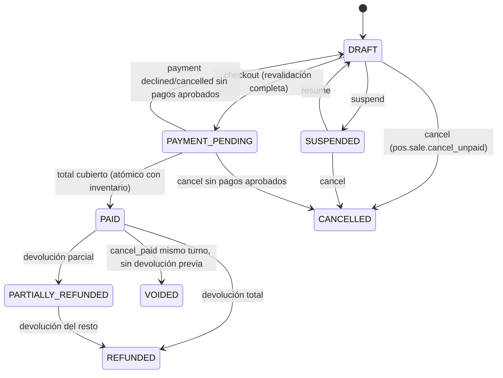

# POS Backend — Arquitectura

Módulo de Punto de Venta presencial, cajas, turnos, arqueos, cortes, devoluciones,
cierre diario, reportes y auditoría para el backend de Club León.

Alcance: **backend operativo**. No incluye facturación fiscal (CFDI/SAT), multi-sucursal,
contabilidad ni rediseño de frontend.

---

## 1. Arquitectura encontrada

### 1.1 Runtime

| Elemento | Valor |
|----------|-------|
| Runtime | Node.js 22, TypeScript 4.9, `strict: true` |
| Transporte | Express 4 en un único Cloud Function Gen2 `api` (`onRequest`, 1GiB, invoker público) |
| Entry point HTTP | `functions/src/index.ts` → `functions/src/app.ts` |
| Hub de rutas | `functions/src/routes/index.ts`, montado en `app.use("/api", routes)` |
| Validación | Zod 3 + `validateBody/validateParams/validateQuery` (`functions/src/middleware/validation.middleware.ts`) |
| Tests | Jest 30 + ts-jest, `functions/tests/*.test.ts`, `--runInBand` |
| Docs | `swagger-jsdoc` para la API tienda (solo dev) + YAML OpenAPI por módulo (patrón `loyalty`) |

### 1.2 Dos bases Firestore

| App Admin | Database | Uso |
|-----------|----------|-----|
| `TIENDA_APP` (`firestoreTienda`) | `tiendacl` | Catálogo, inventario, ofertas, códigos, órdenes, pagos, POS |
| `APP_OFICIAL` (`firestoreApp`) | `(default)` | `usuariosApp`, Auth, App Check, lealtad, rate limits |

`admin.initializeApp` se ejecuta en `config/firebase.admin.ts` (default), `config/firebase.ts`
(`TIENDA_APP`) y `config/app.firebase.ts` (`APP_OFICIAL`). **El POS no crea apps ni clientes nuevos.**

### 1.3 Autenticación y roles existentes

- `authMiddleware` (`functions/src/utils/middlewares.ts`): JWT propio (`JWT_SECRET`), recarga el
  usuario desde `usuariosApp` en cada request, deja `req.user` con el rol **fresco de Firestore**.
- `firebaseAuthMiddleware`: Firebase ID token (usado por rutas de app móvil).
- `requireStaff` = `SUPER_ADMIN | ADMIN | EMPLEADO`; `requireAdmin` = `SUPER_ADMIN | ADMIN`.
- Roles en `RolUsuario`: `SUPER_ADMIN, ADMIN, EMPLEADO, CLIENTE, EMPLEADO_CLUB,
  TRABAJADOR_CLUBLEON, CONCESION_SUPERADMIN, CONCESION_ADMIN, CONCESION_VENDEDOR`.
- App Check: `optionalAppCheckMiddleware` global, **observacional**, y con bypass si la petición
  trae `Authorization: Bearer`. El módulo AI tiene su propio middleware `observe|enforce`.

### 1.4 Fuentes de verdad reutilizadas por el POS

| Dominio | Colección / Servicio | Notas |
|---------|----------------------|-------|
| Productos | `productos` | Campos en español. `precioPublico` es **float en pesos** |
| Variante vendible | `productoId` + `tallaId` opcional | No hay colección de variantes |
| Inventario | `productos.inventarioGlobal` / `productos.inventarioPorTalla[]` | buckets `fisica / reservada / noDisponible`; `disponible = max(0, fisica - reservada - noDisponible)` |
| Movimientos inventario | `movimientosInventario` | ya soporta `ventaPosId` |
| Ofertas | `ofertas` + `utils/ofertas-pricing.util.ts` (`seleccionarMejorOferta`) | prioridad, vigencia, alcance, stock de oferta |
| Códigos | `codigos_promocion` + `codigosPromocionService.validar` | solo porcentaje; `acumulableConOfertas` |
| Usuarios/roles | `usuariosApp` (`firestoreApp`) | `rol`, `activo` |
| Utilidades stock | `utils/inventory-stock.util.ts` | `projectLegacyFromProductData`, `buildFirestoreInventoryPatch`, `normalizeSizeBuckets`, `normalizeGlobalBuckets` |

### 1.5 Deuda técnica detectada que afecta al POS

| ID | Hallazgo | Impacto | Tratamiento |
|----|----------|---------|-------------|
| D1 | `productService.updateStock` calcula la cantidad final **fuera** de la transacción (`inventoryService.registerMovement` lee y luego escribe) → carrera bajo concurrencia real | Overselling si dos cajas venden la última unidad | El POS **no** usa esa ruta: descuenta dentro de una única transacción releyendo el documento (`posInventoryService`). No se modifica el código legacy para no romper checkout ecommerce; queda documentado como riesgo R1 |
| D2 | `ventasPos` / `posSessions` son una implementación mínima usada **solo** por el rail Aplazo in-store (`payment-finalizer.service.ts`), sin efectivo, turnos ni cortes | Confusión de nomenclatura | Se conservan intactas. El POS completo usa colecciones `pos*` nuevas. Ver decisión DEC-02 |
| D3 | Montos del ecommerce en **float pesos**; pagos en **centavos** | Errores de redondeo | El POS almacena y calcula **solo en centavos enteros**; convierte una única vez en la frontera con los servicios de pricing legacy (`majorToMinor`) |
| D4 | App Check global se omite cuando existe `Authorization: Bearer` | Un JWT robado basta | El router POS aplica su propio App Check **sin** bypass por Bearer |
| D5 | `firestore.rules` es deny-by-default con catch-all `allow read, write: if false` | — | Favorable: las colecciones `pos*` quedan cerradas a clientes por defecto. Se añade un bloque explícito para hacerlo intencional y auditable |

---

## 2. Arquitectura objetivo

```
functions/src/modules/pos/
├── constants/          pos.constants.ts            colecciones, defaults, denominaciones, límites
├── models/             pos.enums.ts, pos.types.ts  estados, capacidades, entidades
├── errors/             pos-problem.error.ts        RFC 7807 + catálogo de códigos
├── domain/             módulos puros y testeables sin Firestore
│   ├── money.ts               enteros en centavos
│   ├── operational-date.ts    America/Mexico_City + cutoff
│   ├── state-machines.ts      transiciones por entidad
│   ├── cash-count.ts          totales por denominación
│   ├── expected-cash.ts       efectivo esperado a partir del ledger
│   ├── cut-classification.ts  tolerancias y clasificación
│   ├── refund-allocation.ts   reparto de reembolso en pago mixto
│   └── capabilities.ts        matriz rol → capacidades
├── repositories/       acceso Firestore encapsulado (una clase por agregado)
├── services/           reglas de negocio (transacciones, autorización, auditoría)
├── controllers/        HTTP puro: parseo del actor, delegación, respuesta
├── validators/         esquemas Zod (params, query, body, env)
├── middleware/         actor, capacidades, App Check, idempotencia, rate limit, errores
├── routes/             pos.routes.ts → montado en /api/pos/v1
├── openapi/            pos-v1.openapi.yaml
└── scripts/            seed emulador + migración idempotente
```

Reglas de capa:

- Controllers **no** contienen reglas de negocio ni aritmética monetaria.
- Services orquestan transacciones y son los únicos que emiten eventos de auditoría.
- Repositories son los únicos que tocan Firestore.
- `domain/*` no importa Firestore ni Express: es 100% unit-testeable.
- Composición explícita por singletons (`export const xService = new XService()`), igual que
  `modules/loyalty`. **No** se introduce un framework de DI.

---

## 3. Límites de módulos

| El POS **sí** posee | El POS **no** posee (consume) |
|---------------------|-------------------------------|
| Cajas, sesiones, turnos | Catálogo de productos, tallas, categorías, líneas |
| Ventas presenciales y sus snapshots | Motor de ofertas (`ofertasService`) |
| Pagos POS (CASH / CARD_EXTERNAL / MIXED) | Validación de códigos (`codigosPromocionService`) |
| Ledger de efectivo | Buckets de inventario en `productos` |
| Arqueos, cortes, cierre diario | Usuarios y roles (`usuariosApp`) |
| Devoluciones y reembolsos POS | Stripe / Aplazo (rails online y Aplazo in-store) |
| Auditoría e incidencias POS | Órdenes ecommerce (`ordenes`) |

El POS **escribe** en dos colecciones ajenas, de forma controlada y con la misma semántica:
`productos` (buckets de inventario) y `movimientosInventario` (trazabilidad, con `ventaPosId`).

---

## 4. Modelo de dominio



Vocabulario (no son sinónimos):

- **Caja** (`posRegisters`): punto físico de venta.
- **Sesión de caja** (`posRegisterSessions`): apertura con fondo inicial → cierre.
- **Turno** (`posShifts`): periodo de responsabilidad de **un** cajero dentro de una sesión.
- **Arqueo** (`posCashCounts`): conteo físico versionado.
- **Corte de turno** / **corte de caja** (`posCuts`, `scope = SHIFT | SESSION`).
- **Cierre del día** (`posDailyClosures`): consolidación por `operationalDate`.
- **Venta** (`posSales`) ≠ **Pago** (`posPayments`) ≠ **Movimiento de efectivo** (`posCashMovements`).
- **Devolución** (`posReturns`) genera **reembolso** (efectivo y/o tarjeta externa).
- **Cancelación**: invalidación controlada según estado (nunca borra una venta pagada).
- **Incidencia** (`posIncidents`): anomalía con seguimiento.

---

## 5. Máquinas de estado

Centralizadas en `domain/state-machines.ts`. Ninguna transición ocurre por `PATCH /status`.
Cada transición declara: origen, destino, capacidad requerida, precondiciones, efectos y evento
de auditoría. Una transición inválida produce `INVALID_STATE_TRANSITION` (409).

### 5.1 Caja (`PosRegisterStatus`)



### 5.2 Sesión de caja (`PosSessionStatus`)

`OPEN → HANDOFF_PENDING → OPEN` (cambio de cajero) · `OPEN → COUNTING → REVIEW_PENDING → CLOSED`
· cualquier estado no cerrado `→ FORCED_CLOSED` (requiere motivo + incidencia).

### 5.3 Turno (`PosShiftStatus`)

`ACTIVE → HANDOFF_PENDING → CLOSED` · `ACTIVE → COUNTING → SUBMITTED → UNDER_REVIEW →
{APPROVED | REJECTED | SECOND_COUNT_REQUIRED | ESCALATED}` · `SECOND_COUNT_REQUIRED → COUNTING`
· `APPROVED → CLOSED` · `* → FORCED_CLOSED`.

### 5.4 Venta (`PosSaleStatus`)



Regla dura: **una venta `PAID` nunca pasa a `CANCELLED`**. Se anula (`VOIDED`, con reversa de
inventario y de efectivo dentro del mismo turno) o se devuelve (`posReturns`).

### 5.5 Pago (`PosPaymentStatus`)

`PENDING → {APPROVED | DECLINED | CANCELLED}` · `APPROVED → {PARTIALLY_REFUNDED | REFUNDED}`.
Efectivo nace `APPROVED` (dinero en cajón). Tarjeta externa nace `PENDING` y se aprueba con
referencia + monto aprobado.

### 5.6 Movimiento de efectivo (`PosCashMovementStatus`)

`PENDING_AUTHORIZATION → {APPROVED | REJECTED | CANCELLED}` · transferencias/retiros:
`APPROVED → IN_TRANSIT → RECEIVED`. Solo `APPROVED` y `RECEIVED` afectan el efectivo esperado
(según el tipo). Los movimientos son **inmutables**: una corrección crea reversa + ajuste.

### 5.7 Corte (`PosCutStatus`)

`DRAFT → COUNTING → SUBMITTED → UNDER_REVIEW →
{APPROVED | REJECTED | SECOND_COUNT_REQUIRED | ESCALATED}` · `SECOND_COUNT_REQUIRED → COUNTING`
· `ESCALATED → {APPROVED | REJECTED}` (solo admin) · `APPROVED → REOPENED` (nueva versión)
· `APPROVED → CLOSED` (al cerrar el día).

### 5.8 Cierre diario (`PosDailyCloseStatus`)

`DRAFT → {BLOCKED | READY} → CLOSED` · `BLOCKED → FORCED_CLOSED` (capacidad
`daily_close.force` + motivo + lista de bloqueos ignorados + incidencia).

---

## 6. Modelo de datos

Todas las colecciones viven en `firestoreTienda` (`tiendacl`) y llevan `storeId` (`MAIN_STORE`).
Todo importe es **entero en centavos** con sufijo `Minor`. Todo timestamp lo genera el servidor.

| Colección | Doc ID | Contenido / notas |
|-----------|--------|-------------------|
| `posSettings` | `MAIN_STORE` | Configuración operativa versionada (tolerancias, límites, denominaciones, flags) |
| `posOperators` | `uid` | Rol POS efectivo (`CASHIER | SENIOR_CASHIER | SUPERVISOR`) para usuarios `EMPLEADO`. `ADMIN`/`SUPER_ADMIN` no requieren documento |
| `posRegisters` | auto | Caja: `code` único, `status`, `activeSessionId`, `currentShiftId`, `currentCashierUid`, `config`, `version`, `archived` |
| `posRegisterSessions` | auto | Sesión: `registerId`, `operationalDate`, `openingFloatMinor`, `status`, `shiftIds`, `openedBy`, `closedBy`, `version` |
| `posShifts` | auto | Turno: `sessionId`, `registerId`, `cashierUid`, `receivedFloatMinor`, `handedOverMinor`, `status`, `totals` (proyección), `cutId`, `version` |
| `posShiftLocks` | `uid` | Lock lógico: un turno activo por cajero |
| `posSales` | auto | Venta con `items[]` acotados (`maxLinesPerSale`), snapshots de producto/precio/oferta, `totals`, `payment` resumen, `version` |
| `posPayments` | auto | Pago: `saleId`, `method`, `amountMinor`, `receivedMinor`, `changeMinor`, `card` (terminal/referencia/autorización), `status` |
| `posCashMovements` | auto | Ledger inmutable append-only |
| `posCashCounts` | auto | Arqueo: `denominations[]`, `countedCashMinor` recalculado, `version` (1,2,3…), `status` |
| `posCuts` | auto | Corte: folio, totales por método, esperado/contado/diferencia, clasificación, revisor/aprobador |
| `posCutVersions` | auto | Snapshot inmutable de cada versión del corte |
| `posReturns` | auto | Devolución: líneas, `refundBreakdown`, condición física, reposición |
| `posDailyClosures` | `operationalDate` (`YYYY-MM-DD`) | **Doc ID = fecha ⇒ unicidad garantizada** |
| `posIncidents` | auto | Incidencia con `history[]` acotado |
| `posAuditEvents` | auto | Append-only. Sin endpoints de edición/borrado |
| `posIdempotency` | hash | `operation`, `actorUid`, `resourceKey`, `requestHash`, `status`, `statusCode`, `responseBody`, `expiresAt` |
| `posSequences` | `{tipo}:{fecha}:{registerCode}` | Folios legibles, contención acotada por caja/día |
| `posExports` | auto | Export con `status`, `filters`, `rowCount`, `content`, `expiresAt` |
| `posLocks` | clave lógica | Locks de exclusión (apertura de caja, cierre diario) |

Snapshots obligatorios en cada línea de venta: `productoId`, `clave` (SKU), `descripcion`,
`barcode?`, `tallaId`, `tallaCodigo`, `unitPriceOriginalMinor`, `unitPriceMinor`,
`offerDiscountMinor`, `codeDiscountMinor`, `manualDiscountMinor`, `taxMinor` (informativo, 0 hoy),
`quantity`, `lineTotalMinor`, `offerId`, `offerTitle`. Una venta histórica se reconstruye sin
volver a leer el catálogo. **No** se copian imágenes; solo referencias.

Anti-crecimiento ilimitado: los arrays acotados por configuración son `items` (≤ 120),
`denominations` (≤ 24) e `history` de incidencias (≤ 200). Todo lo demás es colección o
subcolección.

---

## 7. Estrategia de autorización

Cinco pasos obligatorios, en este orden, para toda ruta POS:

1. `posAppCheckMiddleware` — `observe | enforce` (`POS_APP_CHECK_MODE`). **Sin** bypass por Bearer.
2. `authMiddleware` — JWT propio ya existente; recarga rol y `activo` desde `usuariosApp`.
3. `posActorMiddleware` — construye `req.posActor { uid, role, posRole, capabilities }`.
   Rechaza `activo === false` y roles sin acceso POS.
4. `requirePosCapability(cap)` — capacidad centralizada, nunca comparación de strings de rol.
5. Ownership + estado, dentro del service (no en el controller).

Matriz rol → capacidades en `domain/capabilities.ts`:

| Rol POS | Origen |
|---------|--------|
| `CASHIER` | `RolUsuario.EMPLEADO` sin documento en `posOperators` |
| `SENIOR_CASHIER` | `EMPLEADO` con `posOperators.posRole = SENIOR_CASHIER` |
| `SUPERVISOR` | `EMPLEADO` con `posOperators.posRole = SUPERVISOR` |
| `ADMIN` | `RolUsuario.ADMIN` |
| `SUPER_ADMIN` | `RolUsuario.SUPER_ADMIN` |

Roles `CLIENTE`, `EMPLEADO_CLUB`, `TRABAJADOR_CLUBLEON` y `CONCESION_*` no tienen `pos.access`.
No se crean roles nuevos en `RolUsuario`: se reutilizan los existentes y se refina con
`posOperators`, gestionado por `pos.config.manage`.

Invariantes de separación de responsabilidades (`domain/capabilities.ts` + services):

- Un cajero solo opera **su** turno activo (`shift.read_own`, `register.read_own`).
- Un cajero **no** ve efectivo esperado ni diferencia antes de enviar su conteo (arqueo ciego).
- `cut.approve` sobre un corte propio → `SELF_APPROVAL_FORBIDDEN` (403), incluso para supervisor.
- `cash_movement.approve` de un movimiento solicitado por el mismo actor → `SELF_APPROVAL_FORBIDDEN`.
- Descuento manual por encima del límite del actor exige `authorizerUid` distinto del solicitante.
- `register.force_close`, `cut.reopen`, `daily_close.force` exigen `reason` y generan incidencia.
- Recursos ajenos se ocultan como `404 POS_RESOURCE_NOT_FOUND` para evitar enumeración.

---

## 8. Estrategia de concurrencia

| Riesgo | Mecanismo |
|--------|-----------|
| Dos aperturas de la misma caja | Transacción + `posRegisters.activeSessionId == null` + `posLocks/register-open:{registerId}` creado con `tx.create` |
| Dos turnos del mismo cajero | `posShiftLocks/{uid}` creado con `tx.create` dentro de la transacción |
| Dos cajeros en la misma caja | `posRegisters.currentShiftId` verificado en transacción |
| Dos pagos de la misma venta | Transacción relee la venta, valida `status` y `paidMinor`; `version` optimista |
| Doble descuento de inventario | Todo el commit (venta + pagos + inventario + movimientos + ledger) en **una** transacción; `movimientosInventario` con `idempotencyKey` determinista |
| Dos devoluciones de la misma unidad | Transacción valida `returnedQuantity` acumulada por línea |
| Dos cierres diarios | **Doc ID = `operationalDate`** con `tx.create` |
| Reapertura mientras otro revisa | `version` optimista + `CONCURRENT_MODIFICATION` (409) |
| Transferencia confirmada dos veces | Estado `IN_TRANSIT → RECEIVED` validado en transacción |
| Doble clic / reintento de red / múltiples instancias | `Idempotency-Key` persistido en Firestore |

Ninguna regla crítica usa "leer y luego escribir" fuera de transacción.
Todo `version` se incrementa con `tx.update` y se valida contra `expectedVersion` cuando el
cliente lo envía.

---

## 9. Estrategia de idempotencia

`Idempotency-Key` es **obligatorio** en: apertura de caja, cierre y cierre forzado, inicio y fin
de turno, handoff, pago efectivo/tarjeta/mixto, decline/cancel de pago, movimientos de efectivo y
sus confirmaciones, envío de arqueo, aprobación/rechazo/escalado/reapertura de corte, devolución,
reembolso, cierre diario, ajuste y export.

Clave persistida en `posIdempotency`, doc ID = `sha256(operation | actorUid | resourceKey | key)`:

| Situación | Respuesta |
|-----------|-----------|
| Misma clave, mismo `requestHash`, `COMPLETED` | Se devuelve `statusCode` + `responseBody` guardados, con header `Idempotent-Replay: true` |
| Misma clave, `requestHash` distinto | `409 IDEMPOTENCY_CONFLICT` |
| Misma clave, `IN_PROGRESS` | `409 IDEMPOTENCY_IN_PROGRESS` (reintentable) |
| Misma clave, `FAILED` antes de efectos | Se permite reintento (el registro se libera) |
| Expirada (`expiresAt`) | Se trata como nueva |

`requestHash` = SHA-256 del payload normalizado (claves ordenadas recursivamente), sin headers ni
timestamps. TTL configurable, default 24 h.

---

## 10. Estrategia de inventario

- **No** existe inventario POS separado: se usa el mismo documento `productos` y los mismos
  buckets que el ecommerce.
- Un borrador o una venta suspendida **no** reservan inventario (evita bloquear stock del
  ecommerce). Se revalida en `checkout-preview` y otra vez dentro de la transacción de pago.
- El descuento ocurre **solo** al completar el pago, dentro de la transacción:
  1. `tx.get` de cada `productos/{id}` involucrado.
  2. Proyección con `projectLegacyFromProductData` y cálculo de `disponible`.
  3. Si `disponible < quantity` → abortar con `INSUFFICIENT_STOCK` (409). Nada se escribe.
  4. Decremento de `fisica` (no de `reservada`, porque el POS no reserva) y recomposición con
     `buildFirestoreInventoryPatch`.
  5. `movimientosInventario` con `tipo: VENTA`, `ventaPosId`, `cantidadAnterior`,
     `cantidadNueva`, `diferencia`, actor e `idempotencyKey` determinista
     (`pos-sale:{saleId}:{productoId}:{tallaId}`).
- Caso obligatorio (3 unidades, 4 cajas): las transacciones se serializan por contención del
  documento del producto; tres confirman, la cuarta relee `disponible = 0` y falla con
  `INSUFFICIENT_STOCK`. No hay inventario negativo, ni venta pagada sin descuento, ni doble
  descuento por reintento (idempotencia).
- Devolución: la reposición **no** es automática. Requiere `physicalCondition`
  (`RETURNED_RESELLABLE | RETURNED_DAMAGED | NOT_RETURNED`) y solo `RETURNED_RESELLABLE`
  genera `tipo: DEVOLUCION` con `idempotencyKey` `pos-return:{returnId}:...`, lo que impide
  reponer dos veces la misma unidad.

---

## 11. Estrategia de pagos

Abstracción `PosPaymentMethod = CASH | CARD_EXTERNAL` y la operación compuesta `MIXED`.
La interfaz `PosCardTerminalGateway` (`services/pos-payment.service.ts`) define
`authorize/refund` y su única implementación hoy es `ManualExternalTerminalGateway`, que **no**
contacta ningún banco: registra una operación **ya aprobada** en la terminal física
(terminal, referencia, código de autorización, monto, operador, fecha). Añadir una terminal
integrada en el futuro es implementar la interfaz, sin tocar el dominio.

- **Efectivo**: valida `receivedMinor >= amountMinor`, calcula `changeMinor`, prohíbe cambio
  negativo, crea `posPayments` `APPROVED` y un movimiento `CASH_SALE`.
- **Tarjeta externa**: exige `PAYMENT_PENDING`, `amountMinor <= saldo pendiente`, referencia
  única por terminal (`posLocks/card-ref:{terminalId}:{reference}`), permite `decline` y `cancel`.
  No se captura ni almacena PAN, CVV, vencimiento, banda ni PIN — validado por esquema `.strict()`.
- **Mixto**: un único comando atómico con `parts[]`. La suma de partes aprobadas debe igualar el
  total. Solo la parte efectivo afecta el efectivo esperado; solo la parte tarjeta entra en la
  conciliación de terminal. La venta se contabiliza **una sola vez**
  (`netSalesMinor` se calcula desde `posSales`, nunca sumando pagos).
- Si la tarjeta se rechaza en un pago mixto, la parte en efectivo ya registrada se conserva y la
  venta permanece en `PAYMENT_PENDING` con saldo pendiente; el cajero reintenta o cancela, y la
  cancelación genera un movimiento `CASH_REFUND` de la parte en efectivo. Política documentada en
  `docs/POS_BACKEND_OPERATIONS.md`.

---

## 12. Estrategia de auditoría

`posAuditEvents` es append-only: no hay endpoint de update ni delete, y las reglas Firestore lo
cierran a clientes. Cada evento incluye `eventId`, `eventType`, `occurredAt` (server timestamp),
`actorUid`, `actorRole`, `actorCapabilities` relevantes, `requestId`, `deviceId`, `ipHash`
(SHA-256 truncado, nunca la IP en claro), `userAgent` truncado, `entity`, `entityId`,
`registerId`, `sessionId`, `shiftId`, `before`/`after` **sanitizados** por allowlist, `reason`,
`result` y `metadata`. Nunca tokens, contraseñas, secretos ni datos de tarjeta.
`PERMISSION_DENIED` se registra desde el middleware de capacidades.

El ledger (`posCashMovements`) y los eventos son las fuentes canónicas: las proyecciones
(`posShifts.totals`, `posCuts`, `posDailyClosures`) se pueden reconstruir con
`npm run pos:reconcile` (`scripts/pos-reconcile-projections.ts`).

---

## 13. Endpoints

Prefijo `/api/pos/v1`. Errores `application/problem+json`. Paginación por cursor
(`limit`, `cursor`), orden allowlisted.

<details>
<summary>Listado completo</summary>

**Contexto**: `GET /context` · `GET /capabilities`

**Cajas**: `GET|POST /registers` · `GET|PATCH /registers/:registerId` ·
`POST /registers/:registerId/{open|block|unblock|close|force-close}` ·
`POST /registers/:registerId/archive` · `GET /registers/:registerId/current-session`

**Sesiones y turnos**: `GET /register-sessions` · `GET /register-sessions/:sessionId` ·
`POST /register-sessions/:sessionId/shifts` · `GET /shifts` · `GET /shifts/:shiftId` ·
`GET /shifts/:shiftId/timeline` ·
`POST /shifts/:shiftId/{request-handoff|complete-handoff|start-count|end|force-close}`

**Ventas**: `POST|GET /sales` · `GET /sales/:saleId` · `POST /sales/:saleId/items` ·
`PATCH|DELETE /sales/:saleId/items/:itemId` · `POST /sales/:saleId/reprice` ·
`POST /sales/:saleId/apply-code` · `DELETE /sales/:saleId/applied-code` ·
`POST /sales/:saleId/manual-discount` · `POST /sales/:saleId/{suspend|resume|cancel}` ·
`POST /sales/:saleId/checkout-preview`

**Pagos**: `POST /sales/:saleId/payments/{cash|card-external|mixed}` ·
`POST /sales/:saleId/payments/:paymentId/{decline|cancel}`

**Tickets**: `GET /sales/:saleId/ticket` · `POST /sales/:saleId/ticket/reprint`

**Devoluciones**: `POST /sales/:saleId/returns` · `GET /returns` · `GET /returns/:returnId` ·
`POST /returns/:returnId/{approve|reject|complete}`

**Movimientos**: `GET|POST /cash-movements` · `GET /cash-movements/:movementId` ·
`POST /cash-movements/:movementId/{approve|reject|confirm-delivery|confirm-receipt|cancel}`

**Arqueos y cortes**: `POST /shifts/:shiftId/cash-counts` · `GET /cash-counts/:countId` ·
`POST /cash-counts/:countId/submit` · `GET /cuts` · `GET /cuts/:cutId` ·
`POST /cuts/:cutId/{request-second-count|request-clarification|approve|reject|escalate|reopen}`

**Cierre diario**: `GET /daily-close/:operationalDate/readiness` ·
`POST /daily-close/:operationalDate/{preview|close|force-close}` · `GET /daily-closes` ·
`GET /daily-closes/:dailyCloseId`

**Incidencias**: `GET|POST /incidents` · `GET /incidents/:incidentId` ·
`POST /incidents/:incidentId/{assign|resolve|escalate|dismiss}`

**Reportes y auditoría**: `GET /reports/{shifts|registers|cash-movements|differences|daily-summary|payment-reconciliation}`
· `POST /exports` · `GET /exports/:exportId` · `GET /exports/:exportId/download` ·
`GET /audit-events`

**Configuración**: `GET|PATCH /settings` · `GET|PUT /operators/:uid`

</details>

No se crean endpoints redundantes: el POS **no** duplica catálogo, inventario, ofertas ni códigos;
consume `/api/productos`, `/api/inventario`, `/api/ofertas` y `/api/codigos-promocion`.

---

## 14. Índices Firestore

Añadidos a `firestore.indexes.json` (database `tiendacl`):

| Colección | Campos |
|-----------|--------|
| `posRegisters` | `storeId ASC, archived ASC, code ASC` |
| `posRegisterSessions` | `storeId ASC, operationalDate DESC, openedAt DESC` · `registerId ASC, status ASC, openedAt DESC` |
| `posShifts` | `storeId ASC, operationalDate DESC, startedAt DESC` · `cashierUid ASC, status ASC, startedAt DESC` · `sessionId ASC, startedAt ASC` |
| `posSales` | `storeId ASC, operationalDate DESC, createdAt DESC` · `shiftId ASC, status ASC, createdAt DESC` · `registerId ASC, status ASC, createdAt DESC` · `status ASC, updatedAt ASC` (expiración de borradores) |
| `posPayments` | `saleId ASC, createdAt ASC` · `operationalDate ASC, method ASC, status ASC` |
| `posCashMovements` | `shiftId ASC, createdAt ASC` · `registerId ASC, status ASC, createdAt DESC` · `operationalDate ASC, type ASC, status ASC` · `status ASC, type ASC, createdAt ASC` |
| `posCashCounts` | `shiftId ASC, version DESC` |
| `posCuts` | `storeId ASC, operationalDate DESC, createdAt DESC` · `status ASC, operationalDate DESC` · `cashierUid ASC, operationalDate DESC` · `shiftId ASC, version DESC` |
| `posCutVersions` | `cutId ASC, version DESC` |
| `posReturns` | `saleId ASC, createdAt ASC` · `operationalDate ASC, status ASC` |
| `posIncidents` | `storeId ASC, status ASC, createdAt DESC` · `type ASC, severity ASC, createdAt DESC` |
| `posAuditEvents` | `entity ASC, entityId ASC, occurredAt DESC` · `operationalDate ASC, eventType ASC, occurredAt DESC` · `actorUid ASC, occurredAt DESC` |
| `posDailyClosures` | `storeId ASC, operationalDate DESC` |
| `posExports` | `requestedBy ASC, createdAt DESC` |

---

## 15. Migraciones

`functions/src/modules/pos/scripts/pos-migrate.ts` — idempotente, con `--dry-run`, `--resume`,
reporte final y **sin borrados**:

1. Crea `posSettings/MAIN_STORE` si no existe (nunca sobrescribe valores ya configurados).
2. Crea `posOperators` para los `usuariosApp` con rol `EMPLEADO` que aún no lo tengan
   (`posRole = CASHIER`).
3. Verifica que `productos` tengan `inventarioGlobal`/`inventarioPorTalla` normalizados y
   **reporta** los inconsistentes sin escribir (la normalización real es responsabilidad del
   script existente `migrate:size-inventory`).
4. Valida que no existan colecciones `pos*` con documentos huérfanos.

Comandos separados: `pos:migrate:dry-run`, `pos:migrate:emulator`, `pos:migrate:staging`.
Producción exige `POS_MIGRATION_CONFIRM=I_UNDERSTAND` y **no se ejecuta en esta entrega**.

Rollback lógico: la migración solo crea documentos de configuración; el rollback consiste en
eliminar `posSettings/MAIN_STORE` y `posOperators/*` creados, cuyos IDs quedan en el reporte.

---

## 16. Riesgos

| ID | Riesgo | Severidad | Mitigación |
|----|--------|-----------|------------|
| R1 | `productService.updateStock` (ruta ecommerce) sigue teniendo la carrera D1 | Alta | El POS no la usa. Se recomienda migrar `inventoryService.registerMovement` a transacción completa en un PR separado, fuera de este alcance |
| R2 | Contención del documento `productos` con muchas cajas vendiendo el mismo SKU | Media | Firestore soporta ~1 escritura/s por documento sostenida; el POS escribe una vez por venta pagada. Se documenta alerta de `ABORTED` y reintento |
| R3 | El POS no reserva inventario en borradores: una venta suspendida puede quedar sin stock | Media | Revalidación en `checkout-preview` y en la transacción de pago; error `PRICE_CHANGED` / `INSUFFICIENT_STOCK` con detalle por línea |
| R4 | Reembolso de tarjeta se procesa fuera del sistema | Media | Se registra referencia, actor y fecha; el corte marca la conciliación de terminal como pendiente hasta confirmarse. No se simula conexión bancaria |
| R5 | App Check global sigue omitiéndose con Bearer (D4) | Media | El router POS aplica App Check propio sin bypass. El resto de la API queda igual |
| R6 | Exportaciones grandes podrían exceder el límite de 1 MB por documento | Baja | Límite duro de filas (`maxExportRows`, default 2000) y rango máximo de 90 días; error `EXPORT_RANGE_TOO_LARGE` |
| R7 | `EMPLEADO` es un rol amplio en el ecommerce | Media | `posOperators` refina el rol POS; sin documento, un empleado es `CASHIER` (mínimo privilegio) |
| R8 | Ausencia de emulador de Auth en `firebase.json` | Baja | Las pruebas de integración usan el emulador de Firestore e inyectan el actor; se documenta cómo generar claims |

---

## 17. Decisiones técnicas

| ID | Decisión | Motivo |
|----|----------|--------|
| DEC-01 | POS en `firestoreTienda` (`tiendacl`) | Comparte transacción con `productos` y `movimientosInventario`; Firestore no permite transacciones entre bases |
| DEC-02 | Colecciones nuevas `pos*`; `ventasPos`/`posSessions` legacy intactas | `ventasPos` es un artefacto del rail Aplazo in-store con contrato en producción. Cambiar su forma sería breaking. Se documenta la coexistencia y el POS no escribe en ellas |
| DEC-03 | Todo el dinero del POS en enteros de centavos (`*Minor`) | Evita errores de coma flotante. La conversión ocurre una sola vez en `pos-pricing.service.ts` al consumir los servicios legacy que devuelven pesos |
| DEC-04 | Reutilizar `ofertasService` y `codigosPromocionService` | Prohibido un segundo motor de precios. Se convierte su salida a centavos y se guardan snapshots |
| DEC-05 | Descuento de inventario dentro de la transacción del POS, sin usar `registerMovement` | `registerMovement` no es atómico entre lectura y escritura (D1). Se reutilizan las utilidades de proyección para escribir exactamente la misma forma de documento |
| DEC-06 | Reutilizar `authMiddleware` (JWT propio) | Es el estándar de todas las rutas de staff del repo. Duplicar autenticación está prohibido. El login existente ya se apoya en Firebase Auth |
| DEC-07 | Rol POS en `posOperators` en lugar de nuevos valores en `RolUsuario` | Añadir roles al enum obligaría a tocar claims, reglas y middlewares de toda la API |
| DEC-08 | `posDailyClosures` con doc ID = `operationalDate` | La unicidad del cierre diario queda garantizada por Firestore, sin lock adicional |
| DEC-09 | `operationalDate` = fecha en `America/Mexico_City` desplazada por `operationalDayCutoffHour` (default 0). Toda operación ligada a una sesión **hereda** el `operationalDate` de la sesión | Una venta a las 00:30 de un turno abierto el día anterior pertenece al día operativo de ese turno; el cierre diario cuadra |
| DEC-10 | Folios por `{tipo}:{fecha}:{registerCode}` | Evita un contador global contendido. El ID técnico del documento es independiente del folio |
| DEC-11 | Exportaciones sincrónicas con contenido en Firestore | Los volúmenes de una sola sucursal son pequeños; una cola sería infraestructura innecesaria. El estado del recurso soporta migrar a asíncrono sin cambiar el contrato |
| DEC-12 | App Check propio del POS con modos `observe|enforce` | Requisito explícito de no permitir bypass por JWT; se replica el patrón ya probado del módulo AI |
| DEC-13 | Tolerancia y límites en `posSettings` (Firestore) y no en variables de entorno | Son parámetros operativos que un administrador debe poder ajustar con auditoría |
| DEC-14 | `VOIDED` para anular una venta pagada en el mismo turno | Cumple "una venta pagada no debe convertirse en CANCELLED" y evita que un error de captura obligue a un flujo de devolución completo |

---

## 18. Observabilidad

Logger estructurado `logger.child({ component: "pos.*" })` con `requestId`, `correlationId`,
`userId`, `registerId`, `sessionId`, `shiftId`, `saleId`, `paymentId`, `cutId`,
`operationalDate`, `event`, `result`, `durationMs`, `errorCode`. Nunca payloads completos,
tokens, cookies, secretos ni datos de tarjeta.

Eventos observables emitidos (contadores en logs, listos para métricas basadas en logs):
`pos.sale.paid`, `pos.sale.failed`, `pos.stock.insufficient`, `pos.payment.duplicate_prevented`,
`pos.terminal.error`, `pos.cut.difference`, `pos.close.forced`, `pos.idempotency.conflict`,
`pos.transaction.contention`, `pos.http.5xx`, `pos.http.latency`.

Alertas recomendadas (no se crea infraestructura): ver
`docs/POS_BACKEND_OPERATIONS.md` § Alertas.

## Nota de pruebas en Windows

Ejecutar `npm run test:pos` (suites en secuencia). Un único
`jest --testPathPatterns="pos."` puede abortar el proceso en Windows
(código `-1073740791`) al cargar harness + router juntos; las suites
individuales pasan.
