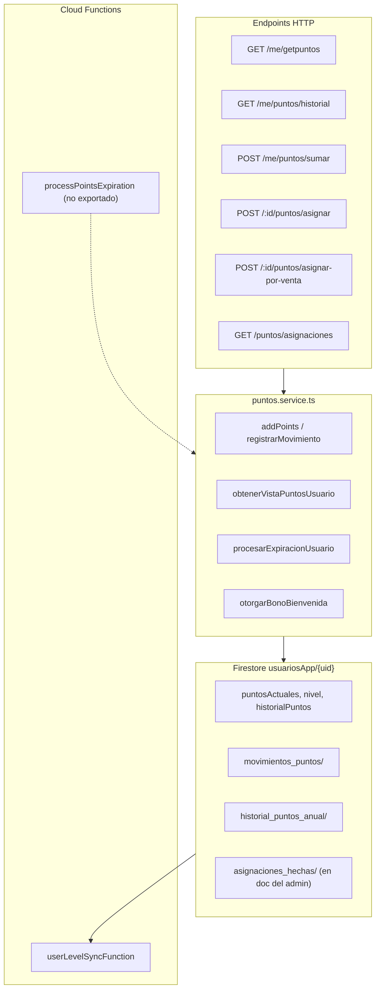

# Staging gate — Loyalty v1

Requisitos antes del despliegue a producción:

1. Proyecto Firebase staging dedicado (no producción)
2. Backup Firestore + PITR documentado
3. `firebase deploy --only firestore:indexes` y esperar índices READY
4. `npm run migrate:ledger -- --dry-run` contra staging
5. Migración real + conciliación + segunda ejecución idempotente
6. E2E: físico (legacy + v1), digital (Stripe/Aplazo webhooks), bienvenida, canjes
7. Ejecutar crons manualmente 2 veces y revisar logs
8. App móvil: verificar GET getpuntos, historial, asignar-por-venta

---

# Documentación: Sistema de Puntos — Estado Actual

**Proyecto:** Club León Ecommerce (BackendCL + TiendaFrontCL)  
**Fecha de revisión:** 30 de junio de 2026  
**Codificación:** UTF-8

---

## Resumen ejecutivo

El sistema de puntos vive principalmente en el **backend** (`functions/src/services/puntos.service.ts`) y se expone vía rutas bajo `/api/usuarios`. El frontend consume algunos endpoints a través del proxy Next.js (`/api/usuarios/**` → backend).

**Estado general:**

| Área | Estado |
|------|--------|
| Consulta de saldo del usuario | ✅ Activo (`GET /me/getpuntos`) |
| Asignación manual (admin/empleado) | ✅ Activo con rol validado |
| Asignación por venta (tienda física) | ⚠️ Activo, pero **sin validación de rol** en la ruta |
| Historial de asignaciones | ✅ Activo (admin/empleado) |
| Bonificación promo (+5 pts) | ✅ Backend activo; **no usado en frontend** |
| Bono de bienvenida (+40 pts) | ✅ Automático al registrarse |
| Expiración anual | ⚠️ Lógica implementada; **cron no desplegado** |
| Sincronización de nivel | ✅ Trigger Firestore activo |
| Canje de puntos | ❌ Modelado en tipos, **sin endpoints** |
| Puntos por checkout online | ❌ No integrado con órdenes/pagos |

---

## Arquitectura



**Base URL producción (backend):**  
`https://us-central1-e-comerce-leon.cloudfunctions.net/api`

**Proxy frontend:**  
`TiendaFrontCL/src/app/api/usuarios/[[...path]]/route.ts` reenvía a `/api/usuarios{suffix}` con Bearer token.

---

## Modelo de datos (Firestore)

### Documento usuario: `usuariosApp/{uid}`

| Campo | Tipo | Descripción |
|-------|------|-------------|
| `puntosActuales` | `number` | Saldo vigente (fuente de verdad) |
| `nivel` | `string` | Bronce, Plata, Oro, Platino, Diamante, Esmeralda |
| `historialPuntos` | `object` | Metadatos del ciclo actual y resúmenes |
| `bonoBienvenidaOtorgadoAt` | `Timestamp` | Evita doble bono de registro |
| `createdAt` | `Timestamp` | Requerido para ciclos de expiración |

### Subcolecciones por usuario

| Subcolección | Contenido |
|--------------|-----------|
| `movimientos_puntos/` | Ledger de cada movimiento |
| `historial_puntos_anual/` | Resumen por ciclo (`anio1`, `anio2`, …) |

### Subcolección del admin/empleado que asigna

`usuariosApp/{origenId}/asignaciones_hechas/{movimientoId}` — copia del movimiento cuando `origen === "admin"`.

### Configuración: `configuracion/puntos`

Lee `diasExpiracionPuntos`. Si no existe, usa **365 días** por defecto (`puntos-expiracion.config.ts`).

> **Nota:** El modelo `ConfiguracionPuntos` define `puntosPorPesoTienda`, `puntosMinimoCanje`, etc., pero la conversión de venta está **hardcodeada** en el controlador (`dinero * 0.10`), no lee Firestore.

---

## Tipos de movimiento

```typescript
enum TipoMovimientoPuntos {
  ACUMULACION   // Ganancia normal (default en addPoints)
  CANJE         // Uso de puntos (sin endpoint)
  AJUSTE        // Ajuste manual
  EXPIRACION    // Puntos vencidos
  BONIFICACION  // Regalo / bienvenida / promo
  DEVOLUCION    // Cancelación
}
```

### Orígenes (`OrigenPuntos`)

`tienda`, `comedor`, `promo`, `admin`, `referido`, `cumpleaños`, `evento`, o string libre.

---

## Endpoints HTTP

Prefijo común: **`/api/usuarios`**

### 1. `GET /me/getpuntos`

| | |
|---|---|
| **Auth** | Bearer obligatorio |
| **Rol** | Cualquier usuario autenticado |
| **Uso frontend** | ✅ `getMyPoints()` en `src/lib/api/users.ts` |

**Comportamiento:**

- Ejecuta expiración lazy del usuario (`procesarExpiracionUsuario`).
- Devuelve saldo + historial resumido + últimos 10 movimientos.

**Respuesta 200:**

```json
{
  "success": true,
  "puntos": 150,
  "cicloActual": 1,
  "proximaExpiracionProgramada": { "_seconds": 1234567890 },
  "historialPuntos": { "...": "..." },
  "movimientosRecientes": ["..."]
}
```

---

### 2. `GET /me/puntos/historial`

| | |
|---|---|
| **Auth** | Bearer obligatorio |
| **Rol** | Usuario autenticado (solo sus datos) |
| **Uso frontend** | ❌ No consumido actualmente |

**Comportamiento:** Igual que `getpuntos` pero con límite de **50 movimientos** y payload en `data`.

**Respuesta 200:**

```json
{
  "success": true,
  "data": {
    "usuario": { "...": "..." },
    "historial": { "...": "..." },
    "movimientosRecientes": ["..."]
  }
}
```

---

### 3. `POST /me/puntos/sumar`

| | |
|---|---|
| **Auth** | Bearer obligatorio |
| **Rate limit** | **1 solicitud / 24 h / UID** (`promoPointsRateLimiter`) |
| **Uso frontend** | ❌ No hay llamadas en el código frontend |

**Comportamiento:**

- Suma **5 puntos fijos** al usuario autenticado.
- Origen: `promo`, descripción: `"Bonificación automática por interacción"`.

**Respuesta 200:**

```json
{
  "success": true,
  "puntos": 155
}
```

---

### 4. `POST /:id/puntos/asignar`

| | |
|---|---|
| **Auth** | Bearer obligatorio |
| **Rol** | `ADMIN` o `EMPLEADO` (`verifyRole`) |
| **Validación** | Zod: `assignUserPointsSchema` |
| **Uso frontend** | ❌ No usado en UI actual (la UI usa asignar-por-venta) |

**Body:**

```json
{
  "points": 120,
  "descripcion": "Ajuste por incidencia resuelta",
  "origenId": "crm-club-leon"
}
```

| Campo | Reglas |
|-------|--------|
| `points` | Número finito > 0 (obligatorio) |
| `descripcion` | Opcional, 1–250 chars |
| `origenId` | Opcional, 1–120 chars |

**Resolución de `origenId`:** `body.origenId` → `req.user.uid` → `"admin-api"`.

**Respuesta 200:**

```json
{
  "success": true,
  "message": "Puntos asignados exitosamente",
  "data": {
    "id": "uid_usuario",
    "puntosAsignados": 120,
    "puntosActuales": 450,
    "descripcion": "Ajuste por incidencia resuelta",
    "origenId": "admin_uid"
  }
}
```

**Errores:** `404` si usuario no existe; `400` validación; `403` sin rol.

---

### 5. `POST /:id/puntos/asignar-por-venta`

| | |
|---|---|
| **Auth** | Bearer obligatorio |
| **Rol** | ⚠️ **No hay `verifyRole`** (cualquier usuario autenticado puede llamarlo) |
| **Validación** | Zod: `assignPointsBySaleSchema` |
| **Uso frontend** | ✅ `/admin/puntos` y `/empleado/puntos` |

**Fórmula backend (fuente de verdad):**

```
puntos = Math.round(dinero * 0.10)
```

Ejemplo: `$350.75` → `35` puntos; `$95` → `10` puntos.

**Body:**

```json
{
  "dinero": 350.75,
  "descripcion": "Venta en tienda física",
  "origenId": "uid_admin_o_empleado"
}
```

**Respuesta 200:**

```json
{
  "success": true,
  "message": "Puntos asignados exitosamente por monto de venta",
  "data": {
    "id": "uid_usuario",
    "montoVenta": 350.75,
    "puntosAsignados": 35,
    "puntosActuales": 485,
    "descripcion": "Venta en tienda física",
    "origenId": "uid_empleado"
  }
}
```

> **Inconsistencia crítica:** Swagger documenta rol ADMIN/EMPLEADO, pero la ruta **no lo exige**. La UI valida rol en frontend, pero la API no.

---

### 6. `GET /puntos/asignaciones`

| | |
|---|---|
| **Auth** | Bearer obligatorio |
| **Rol** | `ADMIN` o `EMPLEADO` |
| **Uso frontend** | ✅ Historial en admin/empleado puntos |

**Query params:**

| Param | Descripción |
|-------|-------------|
| `usuarioId` | Filtrar por usuario destino |
| `empleadoId` | Solo admin: ver asignaciones de otro empleado |
| `limit` | Default 50, máx 100 |
| `cursor` | Path del doc Firestore para paginación |

**Comportamiento de visibilidad:**

- **EMPLEADO:** solo ve asignaciones donde él es `origenId`.
- **ADMIN:** por defecto ve las suyas; con `empleadoId` ve las de ese empleado.

> Swagger menciona `origenId` como query param, pero el código usa **`empleadoId`**.

**Respuesta 200:**

```json
{
  "success": true,
  "data": [
    {
      "id": "mov_id",
      "usuarioId": "uid_destino",
      "usuarioNombre": "Juan",
      "usuarioEmail": "juan@...",
      "puntos": 35,
      "descripcion": "Venta por $350 MXN",
      "origenId": "uid_empleado",
      "createdAt": "..."
    }
  ],
  "pagination": {
    "nextCursor": "usuariosApp/.../asignaciones_hechas/...",
    "hasMore": true
  }
}
```

---

## Flujos no-HTTP (automáticos)

### Bono de bienvenida (+40 puntos)

| Trigger | Archivo |
|---------|---------|
| Registro email | `email-user-registration.service.ts` |
| Auth social | `auth.social.controller.ts` |
| Refresh token (si aplica) | `auth.refresh.controller.ts` |

- Constante: `PUNTOS_BIENVENIDA_REGISTRO = 40`
- Idempotente vía `bonoBienvenidaOtorgadoAt`
- Tipo: `BONIFICACION`, origen: `promo`, referencia: `registro`

### Sincronización de nivel

**Function:** `userLevelSyncFunction` (`puntos-nivel.trigger.ts`) — **desplegada**.

| Puntos | Nivel |
|--------|-------|
| 0–149 | Bronce |
| 150–299 | Plata |
| 300–449 | Oro |
| 450–749 | Platino |
| 750–1049 | Diamante |
| ≥ 1050 | Esmeralda |

Se ejecuta en cada write de `usuariosApp/{userId}` cuando cambia `puntosActuales`.

### Expiración anual

**Lógica:** `puntos.service.ts` → `procesarExpiracionUsuario` / `procesarExpiracionesVencidas`  
**Ciclo:** desde `createdAt`, cada `diasExpiracionPuntos` (default 365). Al cerrar ciclo, el saldo vigente expira (`TipoMovimientoPuntos.EXPIRACION`).

**Ejecución actual:**

- **Lazy:** al consultar puntos o registrar movimiento.
- **Cron programado:** `processPointsExpiration` existe en `puntos-expiracion.cron.ts` pero **no está exportado en `index.ts`** → probablemente **no desplegado**.

---

## Integración frontend

### Consumo activo

| Pantalla | Endpoints |
|----------|-----------|
| `/profile` | `GET /me/getpuntos` (+ fallback `GET /usuarios/{uid}`) |
| `/admin/puntos` | `GET /usuarios/{uid}`, `POST .../asignar-por-venta`, `GET /puntos/asignaciones` |
| `/empleado/puntos` | Igual que admin |
| `/super-admin/usuarios` | Muestra `puntosActuales` en tabla (sin endpoint de puntos dedicado) |

### Fallbacks en `getMyPoints()`

Intenta en orden:

1. `/api/usuarios/me/getpuntos` ✅ existe
2. `/api/usuarios/me/puntos` ❌ **no existe**
3. `/api/usuarios/me` ❌ **no existe**

Solo el primero funciona de forma confiable.

### Inconsistencias UI vs backend (admin)

En `admin/puntos/page.tsx`:

```typescript
const POINTS_PER_PESO = 1; // comentario: 1 MXN = 1 punto
```

Pero el backend calcula `dinero * 0.10`. Además, algunos textos multiplican otra vez por `0.10`:

- Preview: `pointsToAssign * 0.10` (incorrecto si `pointsToAssign` ya es `money * 1`)
- Botón: `Asignar ${pointsToAssign * 0.10} puntos`
- Confirmación: muestra `{pointsToAssign} puntos` (valor en pesos, no puntos reales)

**La llamada API envía `dinero` correctamente**; el backend asigna bien. El problema es **solo visual/UX** en admin (empleado muestra mejor el preview).

---

## Reglas de negocio vigentes

| Regla | Valor actual |
|-------|--------------|
| Bono registro | 40 puntos |
| Promo interacción (`/sumar`) | +5 puntos, 1 vez/día |
| Conversión venta tienda | `round(monto_MXN * 0.10)` |
| Expiración | Ciclo anual desde registro (365 días default) |
| Puntos por checkout online | No implementado |
| Canje en tienda | No implementado (solo tipos/modelos) |
| Nivel | Automático por trigger |

---

## Seguridad — hallazgos actuales

| ID | Hallazgo | Severidad |
|----|----------|-----------|
| S-01 | `POST /:id/puntos/asignar-por-venta` sin `verifyRole` | Alta |
| S-02 | `POST /me/puntos/sumar` sin uso frontend pero expuesto a cualquier usuario autenticado (con rate limit 1/día) | Media |
| S-03 | Validación de rol en UI admin es solo UX; backend debe reforzar | Alta |
| S-04 | `puntos/sumar` tiene rate limit (documentado en audit CL-007) | Mitigado |

---

## Tests existentes

| Archivo | Cobertura |
|---------|-----------|
| `functions/tests/users.points.controller.test.ts` | `assignPoints` (manual) |
| `functions/tests/puntos-expiracion.utils.test.ts` | Utilidades de ciclos |
| `functions/tests/user.welcome-bonus.test.ts` | Bono bienvenida |

No hay tests para `assignPointsBySale` ni `getHistorialAsignaciones`.

---

## Endpoints que NO existen (pero el frontend o modelos sugieren)

| Ruta esperada | Estado |
|---------------|--------|
| `GET /me/puntos` | No definida |
| `GET /me` | No definida |
| Canje / redención | No definida |
| Puntos por orden pagada | No definida |
| Ajuste negativo (restar puntos) | No hay endpoint dedicado (`registrarMovimiento` soporta negativos, pero no expuesto) |

---

## Archivos clave

### Backend

- `functions/src/routes/users.routes.ts` — rutas
- `functions/src/controllers/users/users.points.controller.ts` — asignación
- `functions/src/controllers/users/users.query.controller.ts` — consulta
- `functions/src/controllers/users/users.command.controller.ts` — `sumarPuntos`
- `functions/src/services/puntos.service.ts` — lógica central
- `functions/src/middleware/validators/user-points.validator.ts` — validación Zod
- `functions/src/puntos-nivel.trigger.ts` — niveles
- `functions/src/puntos-expiracion.cron.ts` — cron (no exportado)

### Frontend

- `src/lib/api/users.ts` — `getMyPoints()`
- `src/app/api/usuarios/[[...path]]/route.ts` — proxy
- `src/app/admin/puntos/page.tsx` — asignación admin
- `src/app/empleado/puntos/page.tsx` — asignación empleado
- `src/app/profile/page.tsx` — visualización de saldo

---

## Conclusión del estado actual

El sistema de puntos está **parcialmente operativo**:

1. **Funciona hoy:** saldo en perfil, asignación por venta en tienda (vía QR + monto), historial de asignaciones, bono de registro, niveles automáticos, expiración lazy.
2. **Riesgos:** endpoint de asignación por venta sin control de rol en backend; discrepancia UI/backend en conversión de puntos en admin.
3. **Pendiente / incompleto:** canje, puntos por e-commerce, cron de expiración masiva, endpoint `/sumar` sin consumidor, configuración dinámica de `puntosPorPeso` en Firestore.